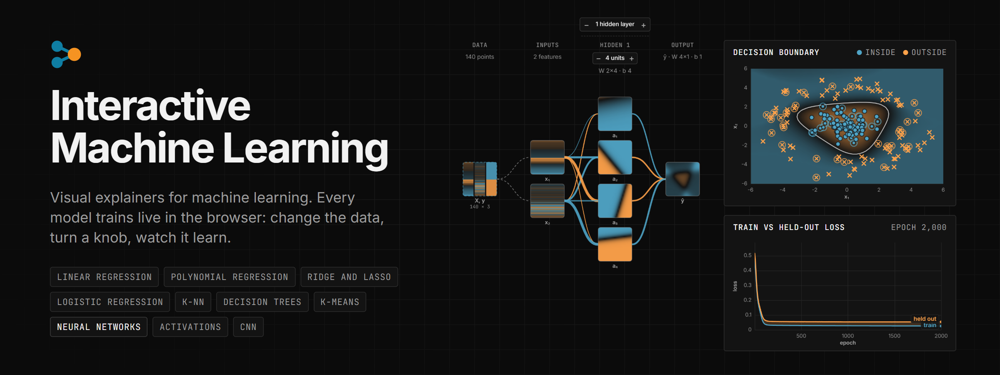

<p align="center">
  <a href="https://nbharathik.github.io/interactive-ml/"></a>
</p>

<p align="center">
  <b>Visual explainers for machine-learning algorithms, trained live in the browser.</b><br />
  <a href="https://nbharathik.github.io/interactive-ml/">Live site</a> · Companion to <a href="https://nbharathik.github.io/blogs">B2logs</a>, where the articles cover the maths
</p>

## Part I

Ten explainers, in reading order:

1. Linear regression
2. Polynomial regression
3. Ridge and lasso
4. Logistic regression
5. k-nearest neighbours
6. Decision trees
7. k-means clustering
8. Neural networks
9. Activations and losses
10. Convolutional networks

Every page opens in free play with every knob live. Each also has a short course: one screen per lesson, a picture that opens already trained, and runs you can replay in one click. Every number a lesson quotes is checked against the real model by the test suite.

## Part II (planned)

Support vector machines, naive Bayes, random forests, gradient boosting, PCA, DBSCAN, attention and transformers, autoencoders, recurrent networks, dropout and batch norm.

## Run it locally

Needs Node 18 or later.

```bash
npm install
npm run dev
```

## Contributing

All contributions are welcome. If you would like to add a new explainer or improve the existing ones, you are welcome to submit a pull request.

## License

[MIT](LICENSE)
